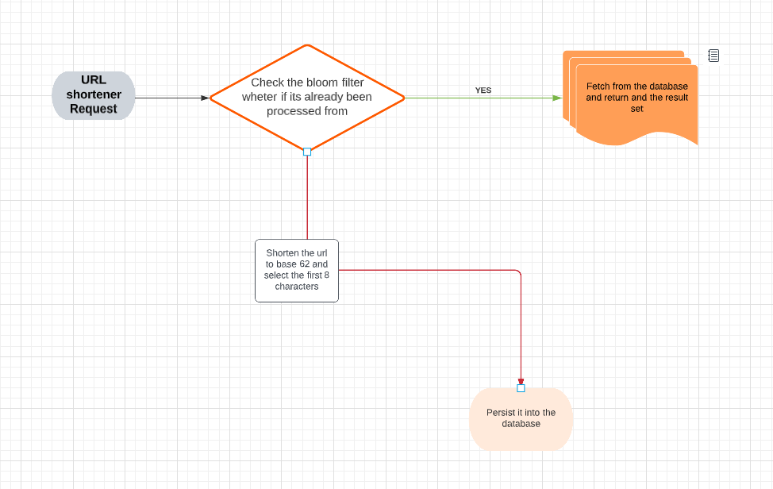
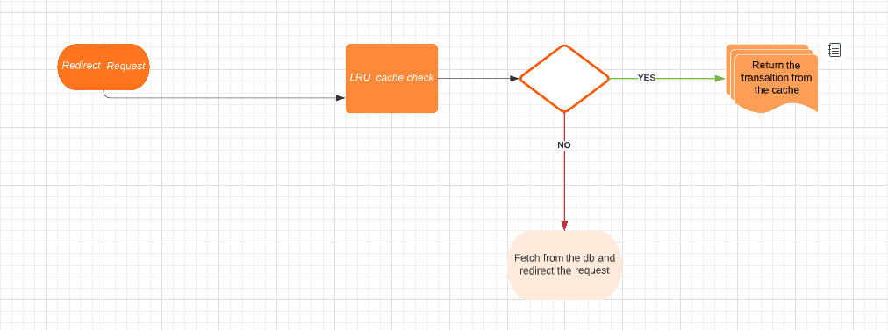

# Url Shortening Spring Boot Application

[](http://www.apache.org/licenses/LICENSE-2.0.html)

Minimal implementation for url shortening as well as redirection.

## Requirements

For building and running the application you need:

- [JDK 17](https://www.oracle.com/java/technologies/downloads/#java17)
- [Maven 3](https://maven.apache.org)
- [Cassandra](https://cassandra.apache.org/_/index.html)

## High Level View Of Requests


#### 1 .   URL shortener




#### 2 .  Url redirect workflow 



## Completed Features
- Exception Handling
- Use bloom filter for a quick url checking before reducing the long links  
- LRU cache for translating the short urls to their respective urls

# Future Work

- Proper validation
- Adding security and rate limiting
- Clustering the specified cassandra nodes for dealling with the massive requests

## Running the application locally

There are several ways to run a Spring Boot application on your local machine. One way is to execute the `main` method in the `de.codecentric.springbootsample.Application` class from your IDE.

Alternatively you can use the [Spring Boot Maven plugin](https://docs.spring.io/spring-boot/docs/current/reference/html/build-tool-plugins-maven-plugin.html) like so:

```shell
mvn spring-boot:run